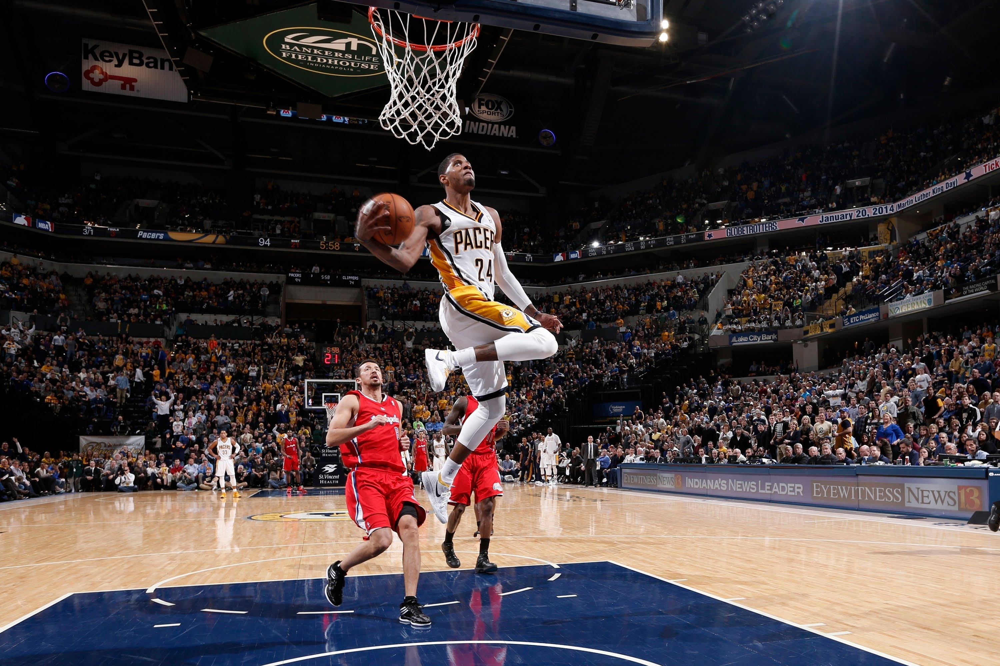

# Welcome

Thanks for visiting Basketball and R! This site focuses on implementing data science ideas and projects using NBA data. <!--more--> All the projects and tutorials on this blog will be using the R programming language, but the ideas behind many of the posts can be re-implemented with whatever tool you feel comfortable with.

The goal of the tutorials I post will be learning how to perform data analysis with an NBA backdrop; the goal is not to learn R from the ground up. Most posts will require some background knowledge of R.

Another thing I want to stress is that I'll be learning some topics along with you guys. There's a lot of different topics that I want to go over, a lot of which I'm not an expert on yet. But I feel that learning some of this stuff with something you're interested in (in this case, basketball) can make things a lot easier. So feel free to ask any questions or give any advice on blog posts.

With all this in mind, welcome again to Basketball and R!
