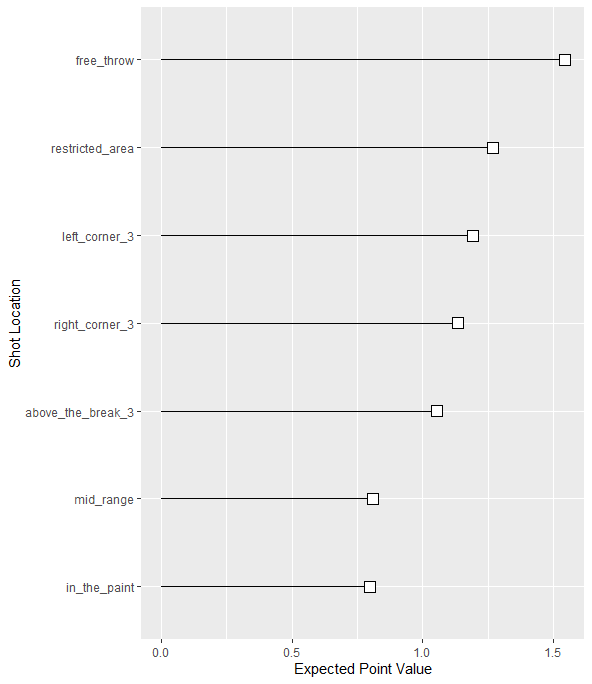
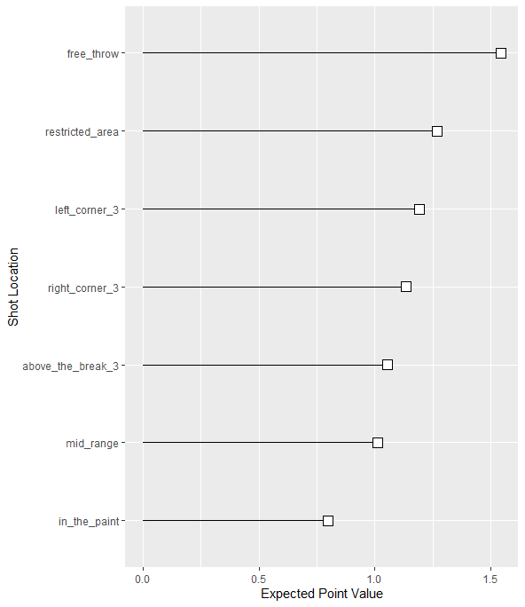
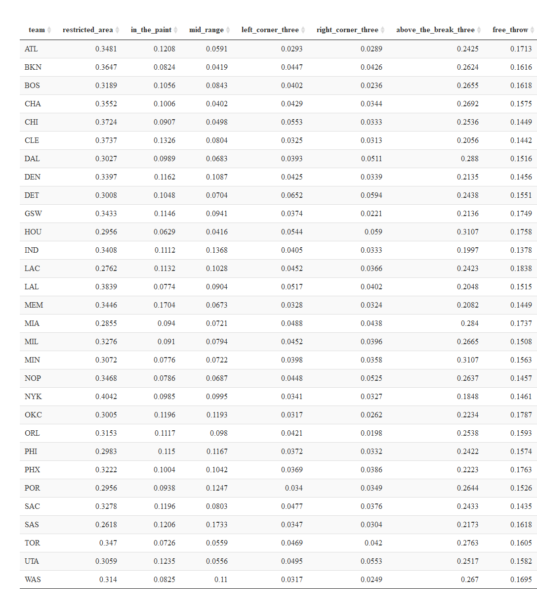
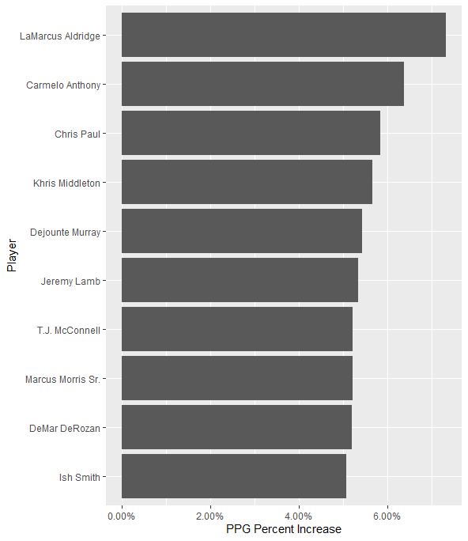
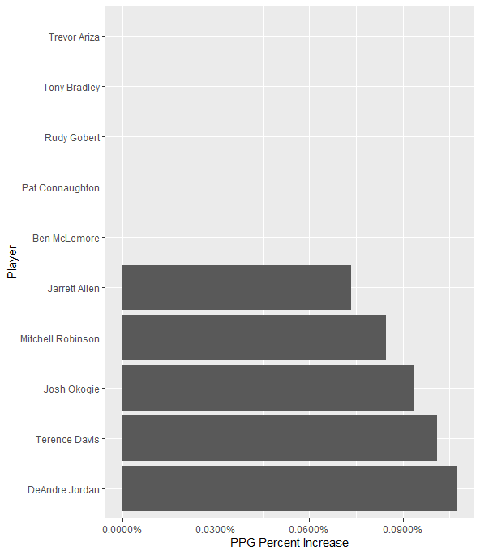
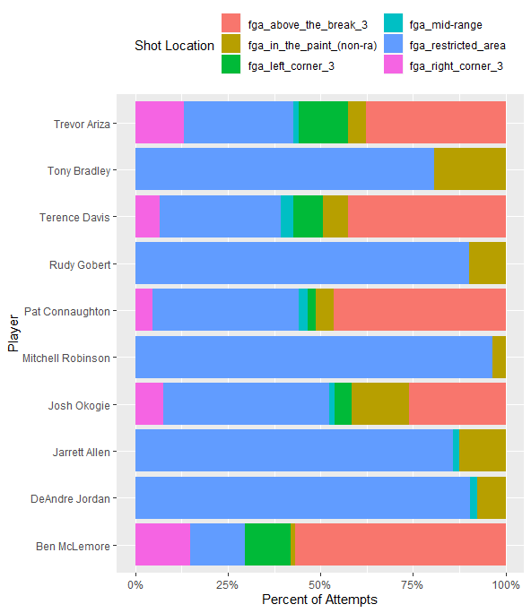

It's not news to anyone that the NBA has shifted in style dramatically over the past decade. A game once played in the post has extended to the three point line for an obvious reason... three is greater than two.

<!--more-->
Despite an increase in action and scoring, there seems to be a growing discontent with the over-reliance on three point shooting. I'm not one to long for the days of an uncoordinted seven footer backing down in the post for twenty seconds before clanging a hook shot off the rim. However, variety is the spice of life, and people will get tired and tune out from a game focused solely on one type of shot.

There have been a lot of interesting ideas brought up to tackle this issue, but the one we'll focus on is changing shot value. There wasn't anything special about the distance the league chose to mark the three point line, but it's impacted what we call a good and bad shot. Why should a three pointer be worth `33%` more than a mid range jump shot from a similar distance.

In this post, we'll look at making a mid-range shot more appealing, by revaluing it from `2` points to `2.5`.

# The Data

For this project, we need shot location data. The [NBA's stats website](https://stats.nba.com/players/shooting/?Season=2019-20&SeasonType=Regular%20Season&DistanceRange=By%20Zone) has shot data from different generalized areas of the court. They include:

-   Restricted area
-   In the paint (non-RA)
-   Mid-range
-   Left corner three
-   Right corner three
-   Above the break three
-   Free throw (Gathered from traditional box scores rather than the above link)

It'd be great if we could a bit more granular, but the NBA hasn't allowed a lot of freedom in terms of tracking stats. With these stats available, however, we can calculate where players prefer to shoot and where they shoot well. For this project, I stuck with data from this past season only (2019-20).

# The Value of a Shot

With data on where each shot was taken from, we can find a general point value of a shot taken in that location. We can do so by multiplying the expected point value of the shot with the field goal percentage of a shot in that location.

The following plot shows the respective point values of a shot from each location (note that `free_throw` is the estimated value of a two-shot trip to the line):

We can see that there is a pretty steep drop off from `above_the_break_3` and the next level, `mid_range`. There isn't a ton of benefit for a team to shoot a mid-range shot. It's difficulty isn't being properly valued in comparison to other locations.

Let's see how this plot would change if we revalued mid-range shots to be worth `2.5` points:

`mid_range` hasn't jumped above any other shot locations in expected point value, but it has become more aligned with them.

Now, you might be wondering why I'm getting so hung up on mid-range shots and not the lowest valued shots: in the paint. My reasoning is based on the fact that there are a lot of other ways to improve the value of shots in the paint before actually changing the point value (removing the three second rule, calling more fouls, etc.). Mid-range shots don't really have these other options.

# By Team

The following table shows the percentage of points each team scores from each area.

Focusing on mid-range shots, we can see that the Spurs are far and away the team that depends on them the most. This may seem like a surprise since the Spurs have this aura of being a modern team in terms of style. However, considering their star players are DeMar DeRozan and LaMarcus Aldridge, the results make a bit more sense.

It's also interesting to see the teams that have the lowest percentage of points from the mid-range area. One might expect to see these teams be the more successful ones in the league (they're shunning a low value shot, after all); however, it's more of a mix of the good and the meh. Expected standouts like Houston and Toronto are there, but so are the Hornets (would not have guessed that).

# By Player

After looking at changes by team, let's look at how this change would effect the average points scored by different players. We'll look at some subsets of players here, but the changes in PPG for every player can be found [here](https://github.com/jcampbellsjci/jcampbellsjci.github.io/blob/master/data/post21_shot-range/player_new_values.csv).

The following plot shows the players with the largest percent increase in PPG from this value change:

Here we can see the players that would benefit the most are who we'd expect. Aldridge would benefit the most by far with a scoring increase of over `7%`. Interestingly, two other Spurs players top the list with Dejounte Murray and DeRozan. There might be an over-reliance on the mid-range specialist in San Antonio.

Let's look at the players least impacted by the value change:

If these players aren't depending on mid-range shots, let's see where they are shooting from. The following plot shows what locations these players are getting their shot attempts from (excluding free throws).

We can see that there are two types of players in this subset: three point shooters and paint players. Mitchell Robinson is an example of the latter with almost all of his shots coming from the restricted area. Ben McLemore is the former, which seems to be the common mold of a Houston rotation player: three or die.

# Impact of Shot Value Change

If the value of a mid-range shot jumped from `2` to `2.5` I would expect to see some more variety in shot location across the league. However, it wouldn't necessarily be the game changer some might expect.

In terms of value by location, it's still the second least valuable location. Why should players eschew a location with more space to get a shot off and an ability to spread the floor, such as a three pointer, for a crowded mid-range shot?

If current shot selection stayed the same, we'd expect to see about a `2%` increase in points per game.

Where I see this type of change having the most impact is with big men. We're currently seeing a lot more centers move to the three point line in an attempt to spread the floor. A lot of these players have seen mixed results shooting from deep; however, take a few steps in and I believe that they could see a big jump in efficiency.

So what else could be done to help spur some variety into the game? One proposal that I've liked from Kirk Goldsberry in [Sprawlball](https://www.amazon.com/SprawlBall-Visual-Tour-New-Era/dp/1328767515) is to include a three second violation in the corners to prevent players from hanging around the area, waiting for a pass from a driving teammate who's collapsed the defense. I like this idea a lot because it increases player movement, doesn't slow down the game, and puts wing players at a similar disadvantage that big men were put in when the original three second rule was introduced.

Until the league starts seeing a dip in viewership, though, don't get your hopes up for much change!
