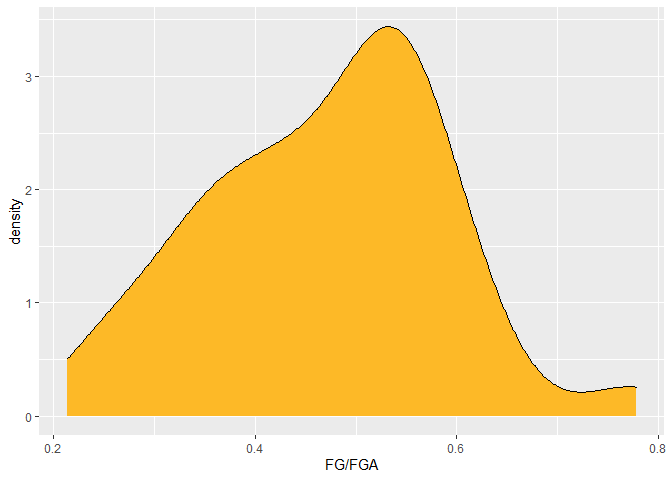
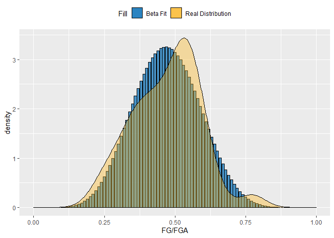
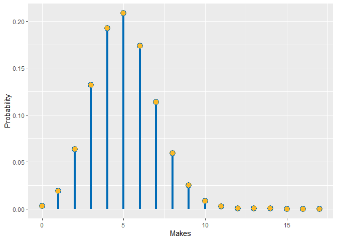
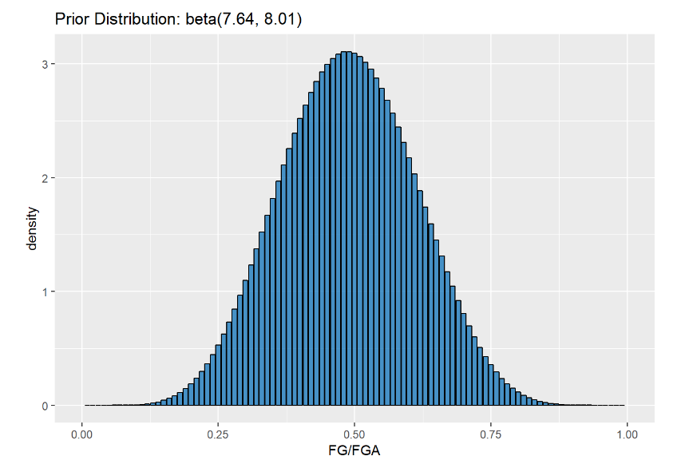
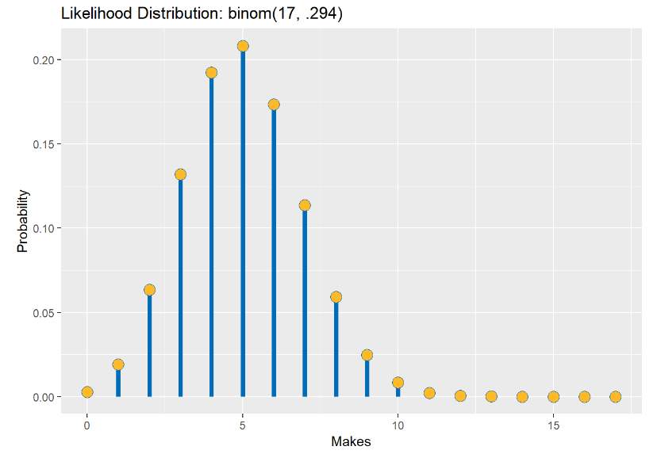
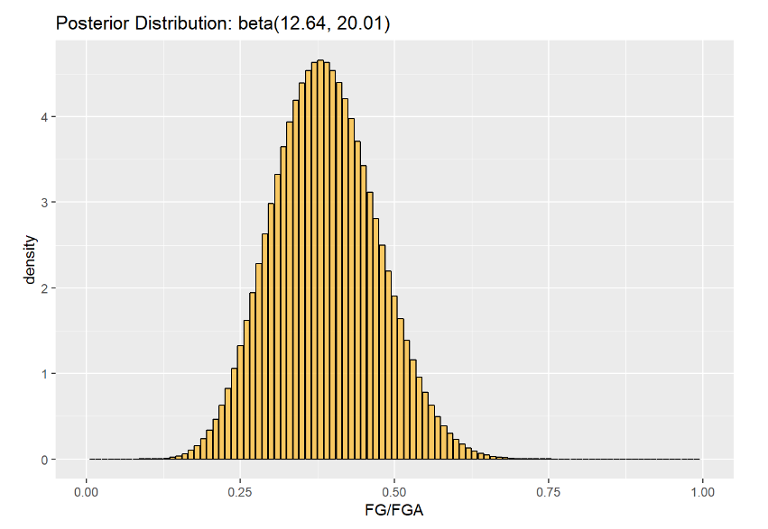

Bayesian Inference Pt. 2: Bayesian Inference
================
2019-02-13 00:00:00

In the last post, we saw a basic overview of Bayes rule, but we didn't see it at its full power. Rather than limiting ourselves to single value priors, we can use a full distribution as a prior. In this post, we'll see a Bayesian example with an expanded our prior and compare it to the more traditional frequentist methodology.

<!--more-->
### The Frequentist Method

Most of my previous blog posts focused on a frequentist topic; t-tests are one example. With t-tests, we want to see if there is a difference in the mean response for two different populations. We can't measure the entire population, so we take samples from both of our groups and compare their distributions.

In this example, we are just using sample data to make assumptions about the population as a whole. Frequentist statistics consider this parameter as a fixed value; in the case of a t-test, the difference between the groups is thought to be an actual fixed number.

### The Bayesion Method

In the last post, we went over Bayes rule:


Let's play around with what *X* and *Y* represent; *X* with , our prior beliefs, and *Y* with <a href="https://www.codecogs.com/eqnedit.php?latex=data" target="_blank"></a>. This makes our equation:


So now, we're looking at finding the probability of our prior beliefs given the data. Let's cover some new vocabulary terms to get us familiar with the Bayesian lingo.

-   Prior: . This is our belief, or hypothesis, going into the model. Our prior can have a large or small impact on the model depending on whether we have strong or weak prior beliefs. For example, I may have a very strong prior belief that Steph Curry is going to hit a three pointer.

-   Likelihood: . This is the probability of seeing our data given our prior beliefs. If we had a strong belief that Steph Curry hits a three, this is the probability of seeing the data we have.

-   Posterior: . This is the probability of our hypothesis given the data.

Notice that <a href="https://www.codecogs.com/eqnedit.php?latex=P(data)" target="_blank"></a>, also known as our evidence, is not impacted at all by our hypothesis. It is acting strictly as a normalizing constant. Because of this, we could say:


Removing the denominator gives us a distribution that is proportional to the posterior distribution. This way, we can still find the most likely value in the posterior distribution without having to calculate <a href="https://www.codecogs.com/eqnedit.php?latex=P(data)" target="_blank"></a>. Note that this would change up the underlying values of the density distribution as they would no longer integrate to 1.

### Should a Shooter Stop Shooting?

As an example, let's look at Steph Curry's shooting ability. Specifically, we'll focus on his Christmas day game against the Lakers, in which he went a pretty poor 5 of 17 from the field. The Warriors lost that game pretty handily, but if you were Steve Kerr, would you have told Curry to not take his next shot? Maybe he should look for some other weapons, rather than continue this sub-30% shooting night.

Let's think about this from a Bayesian perspective... What's the probability of Curry hitting his next shot given that he is currently shooting 5 of 17? Let's break this down by each part of the Bayesian formula:

-   Posterior: P(Curry hits a shot|Curry shoots 5 of 17)
-   Prior: P(Curry hits a shot)
-   Evidence: P(Curry shoots 5 of 17)
-   Likelihood: P(Curry shoots 5 of 17|prior belief that Curry hits a shot)

In terms of our prior, we may have one set value we want to assign to Curry hitting his next shot, but why stop at a single value when we can use a whole distribution?

Let's develop a distribution of Curry's shooting performances from the season up to this point. First we'll pull the data from [basketballreference.com](https://www.basketball-reference.com/players/c/curryst01/gamelog/2019).

``` r
library(rvest)
library(tidyverse)

curry<-
  read_html("https://www.basketball-reference.com/players/c/curryst01/gamelog/2019") %>%
  html_node('#pgl_basic') %>%
  html_table(fill = T) %>%
  .[!is.na(names(.))] %>%
  select(Date, FG, FGA) %>%
  filter(Date != "Date") %>% 
  filter(FG != "Inactive") %>% 
  mutate(Date = as.Date(Date), FG = as.numeric(FG), FGA = as.numeric(FGA))
```

Let's now plot out what that distribution of FG%'s looks like:

``` r
curry %>%
  ggplot(aes(x = FG/FGA)) +
  geom_density(fill = "#FDB927")
```



Now we can fit a distribution to this historical data and use this distribution as our prior. A good distribution we could use to model Curry's prior shooting percentages is a beta distribution. This will look a lot like a normal distribution in most cases, but it is bound between 0 and 1, making it great to model distributions of probabilities.

The beta distribution has two parameters: shape 1 and shape 2. We can think of these two shapes in a more general sense as the number of successes and failures of an experiment. The following plots a few different beta distributions.

<br>
<center>

</center>
Notice how a <a href="https://www.codecogs.com/eqnedit.php?latex=beta(1,&space;1)" target="_blank"></a> distribution is just a flat line; this is known as a uniform prior because it has the same density for all probabilities. Also see how increasing the number of trials creates a distribution with a smaller width and higher peak. That's because we have more trials to base our distribution on!

Let's go ahead and incorporate all of Curry's previous shooting logs into our prior distribution. This process is known as empiracle Bayesian inference because we are using hard data as our prior belief.

We can fit a beta distribution to Curry's past game logs using the `fitdistr()` function in the `MASS` package.

``` r
library(MASS)
beta.param <- fitdistr(x = curry$FG/curry$FGA, densfun = dbeta, 
                       start = list(shape1 = 1, shape2 = 1))

beta.param$estimate
```

    ##   shape1   shape2 
    ## 8.044668 9.029914

We started out with a uniform beta shape and moved to a more concrete distribution with shape values around `8` and `9`.

Let's plot this fit beta distribution to the actual distribution of game logs and see how well it matches up.



It fits pretty well (or about as well as we could do with a pre-defined distribution). We can use MCMC methods to fit distributions that might not match up that well with set distributions, but we'll save that for a future lesson.

Now, let's think about our likelihood. This likelihood distribution allows us to identify the most likely hypothesis given a set of data. Like with our prior, we can represent this in our equation with a distribution. Instead of using past games to model the distribution like we did with our prior, we'll instead use the data we are currently seeing: the Christmas day game.

So, assuming that Curry's Christmas day game represents the probability of him making a shot generally, we want to know the probability of different amounts of shots being made... that sounds like the ideal set-up for a binomial distribution! The binomial distribution has two parameters: the number of successes and the probability of success. Let's plot the likelihood distribution across Curry seeing any number of possible makes, given he took 17 shots.



We can see the likelihood spikes around 5 makes, which makes sense because that is the data we saw. If all we went off of was this one game, a hypothesis that Curry would make about 60% of his shots (10 out of 17) would be extremely low. Luckily, we can update the likelihood with our past knowledge of how Curry actually performs!

### Calculating the Posterior

So, we have our likelihood and priors set up; this is all we need to calculate a distribution that is proportional to the posterior. Remember: . Our evidence is just a constant and would not change up based on our hypothesis, .

Now, let's think of these distributions mathematically:

-   The PMF for a binomial distribution is:  where <a href="https://www.codecogs.com/eqnedit.php?latex=n" target="_blank"></a> is the number of trials, <a href="https://www.codecogs.com/eqnedit.php?latex=k" target="_blank"></a> is the number of successes, and <a href="https://www.codecogs.com/eqnedit.php?latex=p" target="_blank"></a> is the success probability for each trial.
-   The PDF for a beta distribution is:  where  and \[<https://latex.codecogs.com/gif.latex?%5Cbeta>\] are the two shape parameters representing successes and failures and <a href="https://www.codecogs.com/eqnedit.php?latex=p" target="_blank"></a> are the different probability values.

We can multiply these two distributions together to get the posterior distribution; to make our lives easier, we can again remove constants that will not change up based on different probabilities and get a proportional answer. So that means we can remove  and  because those values will only change based on distribution parameters, which we have already set.

That gives us: . We can simplify this to . You may notice that this looks a lot like the beta distribution, and that's because it is! The beta distribution is a conjugate prior for a binomial distribution, meaning that the posterior will also be a beta distribution. We can also add back in the integration constant since this is a beta distribution, which has to be , making our full posterior beta distribution look like:

.

In the end, all we need to do is just add the additional successes and failures we saw in the Christmas day game to the shape parameters of the beta distribution:

`dbeta(x, 5 + beta.param$estimate[1], 12 + beta.param$estimate[2])`.

Let's plot the prior, the likelihood, and the posterior to see how our prior hypothesis changed due to how Curry was playing in the Christmas day game:

<br>
<center>

</center>
<br>
<center>

</center>
<br>
<center>

</center>
We can see visually that the range of possible probabilities for Curry to make a shot has gone down. Let's see what the max probability value has changed to:

``` r
#prior probability
qbeta(p = .5, shape1 = 7.64, shape2 = 8.01)
```

    ## [1] 0.4876628

``` r
#posterior probability
qbeta(p = .5, shape1 = 12.64, shape2 = 20.01)
```

    ## [1] 0.3848048

The probability of Curry making his next shot has decreased by around 10%. This is still higher, of course than we would assume based off of how he's playing in the Christmas day game, where he was shooting 29%, but it's still a big drop.

We can get a range of the values that cover a certain proportion of the posterior distribution, called a credible interval. We can use this similarly to a confidence interval. Let's use qbeta to get a 95% credible interval for the posterior distribution.

``` r
#posterior 95% interval
qbeta(p = c(.025, .975), shape1 = 12.64, shape2 = 20.01)
```

    ## [1] 0.2303314 0.5570436

The odds of Curry hitting his next shot in this game are pretty low... I'm not saying I'd tell him to stop shooting, but maybe it's something to consider!

We are starting to see how helpful Bayesian analysis can be! If we were only judging Steph on his Christmas day game, we'd tell him to pass it if they want to stand any chance against the Lakers. But, when we take our prior knowledge of his ability into account, his odds improve (although they still aren't great). Bayesian inference really lets us perform analysis in a more relatable manner; we are constantly taking past knowledge and beliefs into account when we make decisions.

A great article if you want to see another example of Bayesian inference in the sports field can be found and David Robinson's Variance Explained [blog](http://varianceexplained.org/r/empirical_bayes_baseball/).
