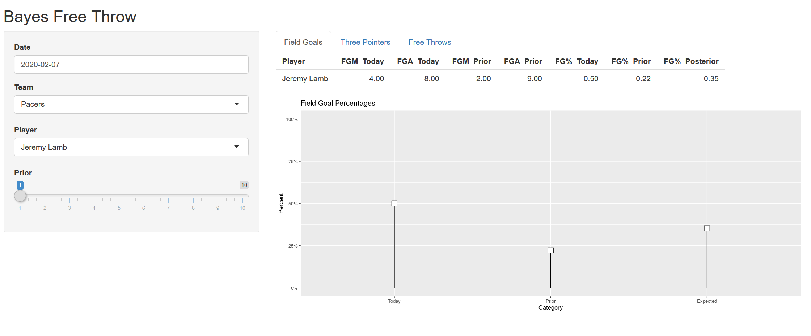

The last time we left off, I talked a bit about using empiracle Bayesian estimation to perform inference. We were able to predict the probability of Steph Curry making a shot based on both his historical stats and his current game performance.

I decided to expand a bit on those posts and set up a larger project in the same vein. In this post, I'll be going over that project, the Bayesian inference shot dashboard `(triumphant horns playing in the distance)`.

<!--more-->

# Recap

So a quick general recap on what makes Bayesian inference useful and unique in comparison to frequentist statistics. Bayesian methodology takes prior beliefs into account. This allows you to go beyond the frequentist method of basing your conclusions on the sample of data you have, and input your prior knowledge and domain expertise into the equation. You combine the data (likelihood) and your prior, and you get a posterior estimate.

However, we don't need to create priors by just saying, "I think this player has a 60% chance of making that shot." We can actually have a full prior distribution. This is more of a model of how we think as humans (at least... I think). We don't just put one number to an event happening, we put many numbers to it, some of which we are confident in, others of which we are not.

In my last post, I went into the idea of empirical Bayesian inference which bases our prior on actual data rather than just a belief.

# Project Overview

So what exactly did I do with this project?

Well, I took the idea of using Bayesian inference to determine what the posterior probability estimate of a player hitting their next shot is and I went a bit more in depth with it.

I split up different shots that we would try to estimate:

* Free throws
* Field goals
* Three pointers

And performed Bayesian inference to create a posterior estimate for each category using multiple priors (anywhere from the last 10 games) for all players playing on a given night.

I put all of this into an interactive shiny dashboard that allows the user to select game dates, teams, players, and priors to estimate what the probability a player's next shot is a make. Here's what a single example would look like:

<center>

</center>

The intended use for this dashboard is for it to be used live, while a game is going on. You can view it anytime, but the point is for you to estimate how likely a player's next shot is going to go in during the current game.

Let me paint a scenario that this dashboard may help with: you're team is up 3 against the Pistons. Andre Drummond gets the ball in the post, spins, makes a shot and gets fouled. All he has to do to tie the game is hit a foul shot. Historically, Drummond is not a great free throw shooter, but he has gone `8/8` from the line tonight. This dashboard will take that data from tonight, combine it with Drummond's past `x` games at the free throw line, and give a posterior distribution of probabilities as to what the chances are that he makes this game tying free throw.

# How it Works

The math behind everything isn't anything new; you can check out the previous blog posts to see what goes into actually creating the numbers.

Historic game logs to get the priors are pulled from basketball reference. This is something I'm looking at improving on, as it takes a bit of time as the season goes on and as we get more games under our belt, to scrape this data. It's pulling the past `x` games of data based on the player, not on the team; so if a player got injured for several games and came back, it would be pulling data to create the prior based on the last games the player was in.

Live data is pulled from nba.com. This stuff gets updated every time you make a new selection, so no need to reload the whole app to keep up with new data.

# How You Can Access It

So I don't have a dedicated server that this app can run on, and have had difficulty getting it to run on shinyapps.io, so that made making it public a bit harder.

What you have to do is install docker. The install is really easy (you can install at [this link](https://docs.docker.com/install/)), and running the app is simple. Just open up your CLI and run the following command:

```{r, eval=F}
docker run --rm -p 80:80 jcampbellsjci/bayes_app
```

This runs the app on port 80 on your local machine. You can go into a browser and type in `localhost:80` and it will take you to the app!

# Conclusion

As I've sort of indicated in some parts of this post, this is an evolving project. We have a good base now, but I might make some changes in the future that I'll try and make note of here.

For the time being, though, have fun and enjoy the app!