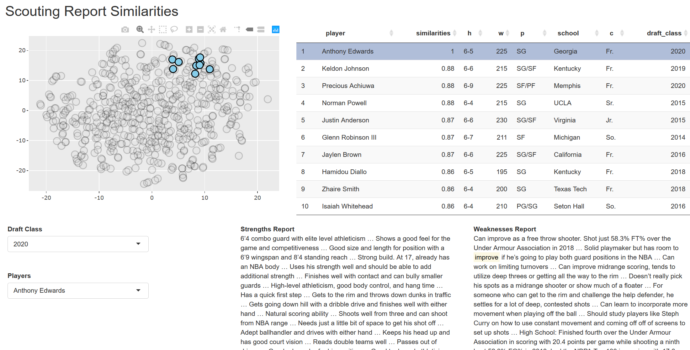
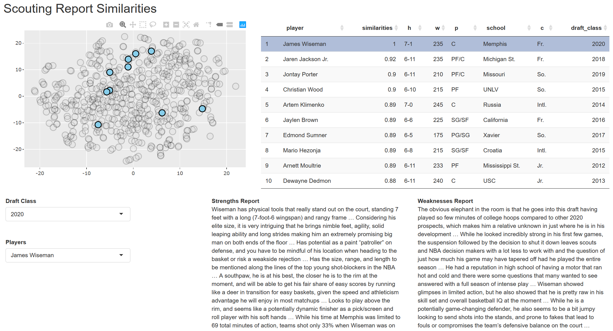

Most of the posts we've explored here have been focused on structured data. This data is organized in a way in which we can perform analysis easily, like the stats page for a player on NBA.com. That's the great thing about doing experiments with a sport like basketball: there are a ton of sources for clean, structured data.

In this project, I wanted to change it up a bit. Rather than looking at data in a structured format, I went the unstructured route, specifically looking at text data. I wanted to see if we could take scouting reports of draft prospects, and compare them to historic scouting reports, allowing us to make comparisons between players. There are a lot of difficulties that come with attacking unstructured data, but it could allow us to come to better conclusions about players.

<!--more-->

# The Data

For this project, I decided to look specifically at scouting reports for players from [nbadraftnet.com](https://www.nbadraft.net/). An example of a typical scouting report for a player (in this case, Anthony Edwards) can be found [here](https://www.nbadraft.net/players/anthony-edwards/).

I chose nbadraftnet for a couple of reasons:

* It's scouting reports are split into strengths and weaknesses. It'll be a bit more straightforward having certain words knowingly associated with bad and good things about a player. Without that distinction, it becomes harder to distinguish whether a word like "shooter" pops up due to the player being a bad shooter or a good one.

* It has over a decade worth of scouting reports that share the same structure.

* It covers a fair amount of prospects, not just 1st round locks.

I pulled scouting reports from the past 9 draft classes as well as the current one, so in total, 10 draft classes. Any player who was included in the 2-round mock draft on nbadraftnet for a given draft class was included.

There are a few players who didn't have scouting reports. Mostly, these are low-tier prospects. It should also be noted that some players have multiple scouting reports from different dates. Rather than include text from all scouting reports, I chose to go with the most recent one as it is the best representation of a player.

Ideally, we'd take scouting reports from several different sources under consideration to give us a more well-rounded view. Unfortunately, due to the lack of a consistent format (not to mention the few scouting report websites available in general) that would be a bit more difficult to gather. For this project, we'll just be using nbadraftnet.

# Methodology

Finding similar players based on numeric data is a fairly easy task. We can just take a couple of vectors of numeric data and calculate some sort of similarity metric. Doing that with text data is a bit more complicated.

To find the most similar players based on an unstructured data source like scouting reports, we need to map that text to some sort of numeric input. We can do this in a lot of ways. A simple example would be word counts. Knowing that the word "athletic" shows up a lot in a scouting report is fairly telling.

Using word counts may be too simple, though. If the word "athletic" shows up a lot in a scouting report, is it because the player is really athletic, or because they aren't athletic at all?

Rather than use word count, I used a method called [Global Vectors](https://nlp.stanford.edu/projects/glove/), or GloVe. GloVe will look at different length windows of text in the scouting reports and see what words co-occur with each other. This methodology captures a bit more semantic context than something like word counts.

Text was input into the GloVe model giving each word in a player's scouting report a numeric vector representation of a certain length. All of the word vectors for a given player were then averaged into one vector.

With each player having a numeric representation of their scouting report, we can now easily calculate similarity between different players' scouting reports.

With that out of the way, let's look at what we actually created!

# The Similarity Dashboard

I made a shiny app that is published on docker to present the information. You can run it on your local machine by running the following in your CLI:

```{r, eval=F}
docker run --rm -p 80:80 jcampbellsjci/draft-text-app
```

The following screenshot shows an example using Anthony Edwards, likely to be a top pick in the upcoming draft (whenever that happens).

<br>

<center>

</center>

<br>

Let's cover everything we see in this dashboard:

* In the bottom left corner, you can select different players based on draft class to be represented in the dashboard. In this case, we can see we've chosen Anthony Edwards from the 2020 class.

* In the upper left corner we have a scatter plot where each point is a player. Points colored blue represent the selected prospect and his `9` most similar colleagues based on scouting report text. This plot is made with `plotly`, so if you hover over any of those `10` blue points, you'll get additional information related to the prospect. Ideally, we see something like this where points are clustered close together.

* In the top right, we have a table representing the selected prospect and his `9` most similar colleagues. If you click on any of these players, their strength and weakness scouting report appears under the table. If a word is highlighted in these scouting reports, it indicates that the word is common among these similar players. The results for that may be pretty rare because these players aren't necessarily similar in word frequency, but in GloVe output.

Looking at Anthony Edwards, we can see the most similar players are wings like him for the most part, notably guys who came into the league known for their athleticism rather than their shooting, like Jaylen Brown and Hamidou Diallo.

Something you may notice is that most of these similar players did not come into the draft with the same lofty status as Anthony Edwards. The scouting report is not a great tool for determining where a player should go in the draft. All players have given strengths and weaknesses, and we're just comparing those among players. It's a bit hard to differentiate a good shooter from another in terms of draft position just based on text; all we know is that they're both good shooters!

Let's look at another interesting example: Deni Avdija

<br>

<center>

</center>

<br>

Avdija is an international prospect with a lot of interest (probably as a result of all of the success Luka Doncic has seen). We can see that a lot of his most similar players are actually international prospects. This is something that can be seen across several different foreign players.

One more example we'll check out is James Wiseman

<br>

<center>

</center>

<br>

Initially, we can see that the majority of similar prospects here are similar interior big men. However, we can start to see the limitations of this text-based approach. There are some wing players who end up being really similar to Wiseman even though they aren't necessarily the same type of player.

Although there are a lot of benefits to exploring players and prospects with this methodology, it certainly isn't the be-all end-all. However, it can, in combination with more structured player performance data, provide a lot of insight that may not be easily accessible or represented otherwise.