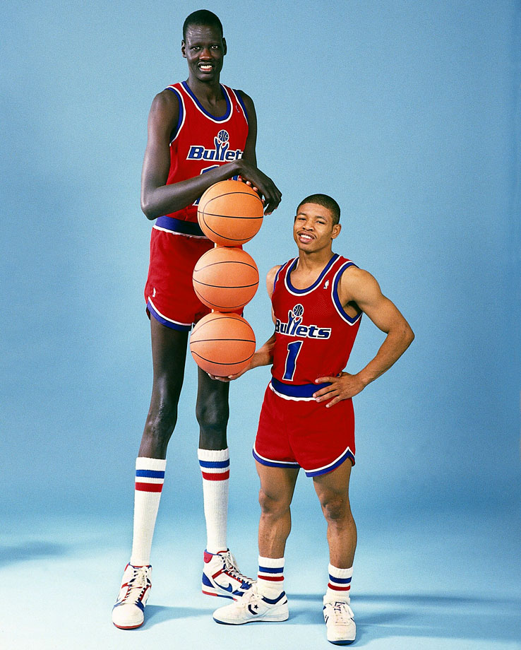
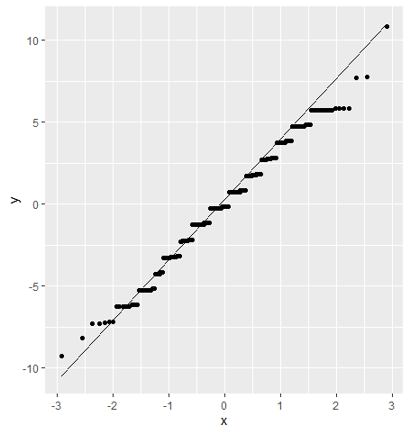

In the last post, I went over using t-tests to compare means between two groups. When we're trying to compare more than two groups however, we move on to an analyis of variance test, also known as ANOVA. ANOVA tests follow the same general procedures as t-tests, but allows for the user to test for differences in the means of more than two groups.

<!--more-->

#The Data

The example we're going to use is pretty arbitrary, but is easy to understand. We're going to use ANOVA to find out if there is a significant difference in the mean height of players in each Eastern Conference division. Let's start by using our [data scraping skills](https://jcampbellsjci.github.io/gettingdata/) to get information from the stats.nba website (remember, this site has its data in JSON format!).

<center>
{#id .class width=350 height=450}
</center>

We'll first bring up the `httr` and `rjson` packages to scrape the data. We'll also be using `purrr` to do some looping.

We can start by specifying our headers and looping through the three different urls will be creating.

```{r, warning=F, message=F}
library(httr)
library(rjson)
library(purrr)
library(dplyr)

headers <- c(
  `Connection` = 'keep-alive',
  `Accept` = 'application/json, text/plain, */*',
  `x-nba-stats-token` = 'true',
  `User-Agent` = 'Mozilla/5.0 (Macintosh; Intel Mac OS X 10_15_2) AppleWebKit/537.36 (KHTML, like Gecko) Chrome/79.0.3945.130 Safari/537.36',
  `x-nba-stats-origin` = 'stats',
  `Sec-Fetch-Site` = 'same-origin',
  `Sec-Fetch-Mode` = 'cors',
  `Referer` = 'http://stats.nba.com/%referer%/',
  `Accept-Encoding` = 'gzip, deflate, br',
  `Accept-Language` = 'en-US,en;q=0.9'
)

divisions <- c("Southeast", "Central", "Atlantic") 
urls <- map(divisions,
            ~ paste0("http://stats.nba.com/stats/leaguedashplayerbiostats?College=&Conference=&Country=&DateFrom=&DateTo=&Division=", ., "&DraftPick=&DraftYear=&GameScope=&GameSegment=&Height=&LastNGaes=0&LeagueID=00&Location=&Month=0&OpponentTeamID=0&Outcome=&PORound=0&PerMode=PerGame&Period=0&PlayerExperience=&PlayerPosition=&Season=2019-20&SeasonSegment=&SeasonType=Regular+Season&ShotClockRange=&StarterBench=&TeamID=0&VsConference=&VsDivision=&Weight="))
```

Next, we'll loop through our urls and pull the data, creating a list with the raw data called `height_raw`.

```{r}
height_raw <- map(1:length(urls),
                  ~ GET(urls[[.]], add_headers(.headers = headers))$content %>%
                    rawToChar() %>%
                    fromJSON())

height_raw <- height_raw %>%
  set_names(divisions)
```

Finally, we'll pull the raw data out and format it into a tibble, called `heights`. To do this, we can create a for loop that loops through data pulled from each division and squashes the data into a data frame using `map_df`. The output is assigned to elements of a list called `height_list`. We then bind each element into our `heights` tibble. It's important to note here that we are also creating a `DIVISION` column within the loop; we need this info later on since we're looking at height differences *by division*. Remember that we need to separately pull out column names and assign them.

```{r}
height_list <- list()
for(i in names(height_raw)){
  height_list[[i]] <- map_df(1:length(height_raw[[i]]$resultSets[[1]]$rowSet),
                             ~ bind_cols(
                               height_raw[[i]]$resultSets[[1]]$rowSet[[.]])) %>%
    mutate(DIVISION = i)
}
heights <- height_list %>%
  bind_rows()

colnames(heights)[1:(length(heights) - 1)] <- height_raw[[1]]$resultSets[[1]]$headers
```

Now we have some data pulled directly from the NBA website! Now let's select only the data we'll be interested in.

```{r}
heights <- heights %>%
  select(DIVISION, PLAYER_NAME, PLAYER_HEIGHT_INCHES, TEAM_ABBREVIATION)
```


#One-way ANOVA

ANOVA tests can look for differences in the response among one or multiple factors. When we look for a difference among the levels of one factor, we are performing a one-way ANOVA; we'll look at that example first.

The assumptions of normality and homogeneity of variance that we saw with t-tests are again used for ANOVA. We'll check out the homogenous variance assumption first.

We're going to use a Bartlett test to test for homogeneity of variance. This test works similarly as the `var.test` command we used to check this assumption for t-tests, but accepts factors with more than two levels. The null hypothesis for `bartlett.test` is that the variance of height for each level are equal.

```{r}
bartlett.test(PLAYER_HEIGHT_INCHES ~ DIVISION, data = heights)
```

Because the p-value for the Barlett test is above .05, we fail to reject the null hypothesis and assume that variances are essentially equal.

We're going to check out the normality assumption after we've built the model. We could use `shapiro.test` or create QQ plots for each level in each grouping variable, but that could end up being a lot of work if we have a factor with a lot of levels. We can use a different method with output from the ANOVA model.

Let's compare the distribution of heights between divisions graphically via a boxplot.

```{r, eval = F}
library(ggplot2)

heights %>%
  ggplot(aes(x = DIVISION, y = PLAYER_HEIGHT_INCHES)) +
  geom_boxplot()
```

<center>
{#id .class width=450 height=400}
</center>

It looks like there isn't a huge difference in distribution of player height between each division, but let's check it out with an ANOVA test.

The `R` command we'll use to make the model is `aov()`. We'll also be using R's formula interface. The formula interface looks like `y ~ x`, where `y` is the dependent and `x` is the independent variable.

In our example, `PLAYER_HEIGHT_INCHES` is our response and `DIVISION` is our grouping variable. Knowing this, let's make an ANOVA model and store it in `div_anova`.

```{r}
div_anova <- aov(PLAYER_HEIGHT_INCHES ~ DIVISION, data = heights)
```

Now we can use the `anova()` command to look at our output in an ANOVA table. The ANOVA table has a lot of output, but our focus will fall to the F-value and its associated p-value.

```{r}
anova(div_anova)
```

Since the p-value is above .05, we fail to reject the null hypothesis; there is no significant difference in player heights between Eastern Conference divisions. The p-value is based on the F-value, which is the ratio of the variance between groups and the variance within groups, represented in the `Mean Sq` column in the ANOVA table. In this case, player heights are not that different between divisions in comparison when we consider how varied they are in general.

We can check for normality by using model errors, also called residuals. We can index them directly from the model object and plot them using a QQ plot.

```{r, eval = F}
tibble(residuals = div_anova$residuals) %>%
  ggplot(aes(sample = residuals)) +
  geom_qq_line() +
  geom_qq()
```

<center>
{#id .class width=450 height=400}
</center>

Unfortunately, `anova()` just gives us info on whether there is a significant difference in the means or not; we don't know how the factor levels differ with each other. For this, we'll need to use a multiple comparison test; one of the most popular is the Tukey Honest Significance Test.

To run the Tukey HSD test, we simply run `TukeyHSD()` on our ANOVA
model.

```{r}
TukeyHSD(div_anova)
```

`diff` measures the average difference while `lwr` and `upr` provide 95% confidence intervals of that difference. We can see that the confidence intervals all include 0, which would indicate to us that no average difference is significantly different from 0.

#Two-way ANOVA

A two-way ANOVA is pretty similar to a one-way ANOVA, it just adds another grouping variable to the equation. We'll continue with our previous example of differences in mean height between Eastern Conference divisions, but we'll add in another grouping variable. We'll add a binary variable indicating whether the player's team made the playoffs this year. Now we're not only looking for a difference in average height by division, but also by playoff and non-playoff teams.

We'll start by creating a vector called `p_teams`. This vector will have the team abbreviations of all Eastern conference playoff teams. From there, we'll create a new column in our `heights` tibble by using an `ifelse` command to see whether each row's `TEAM_ABBREVIATION` is in the `p_teams` vector.

```{r}
p_teams <- c("BOS", "CLE", "TOR", "WAS", "ATL", "MIL", "IND", "CHI")

heights <- heights %>%
  mutate(PLAYOFF = factor(ifelse(TEAM_ABBREVIATION %in% p_teams, 
                                 "Y", "N")))
```

Next let's use the Bartlett test to check for equal variances among the levels of our new grouping variable.

```{r}
bartlett.test(PLAYER_HEIGHT_INCHES ~ PLAYOFF, data = heights)
```

It looks like we meet our assumption of equal variances. Let's move on to the modeling aspect of this proble. When we add another `x` variable to the model, we use the `+` sign in R's formula interface.

```{r}
div_po_anova <- aov(PLAYER_HEIGHT_INCHES ~ DIVISION + PLAYOFF, data = heights)
anova(div_po_anova)

TukeyHSD(div_po_anova)
```

Taking a quick look at our output indicates to us that there is no significant difference in average height among divisions or playoff teams! It doesn't seem that height is being hoarded by one division or that it really determines team success.

As a last step, let's check out our normality assumption for this new model:
```{r, eval = F}
tibble(residuals = div_po_anova$residuals) %>%
  ggplot(aes(sample = residuals)) +
  geom_qq_line() +
  geom_qq()
```

<center>
{#id .class width=450 height=400}
</center>

We can see some slight straying from normality towards the upper tail, but nothing that should have us too worried.

We now have ANOVA modeling under our belts! We are no longer limited to looking for differences between two levels of a factor, nor do we have to stop with only one factor. ANOVA opens up a lot of new modeling possibilities for us, so have fun applying it to some other problems!